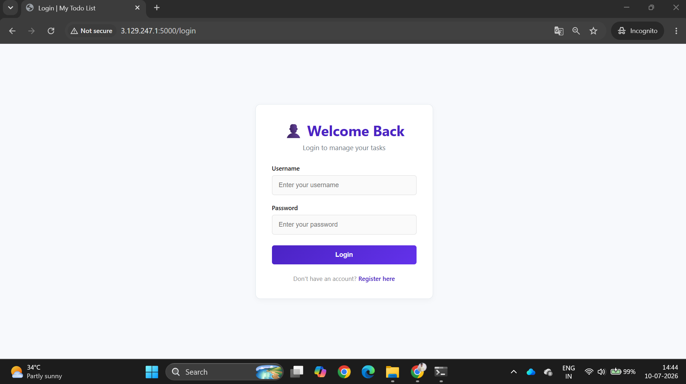
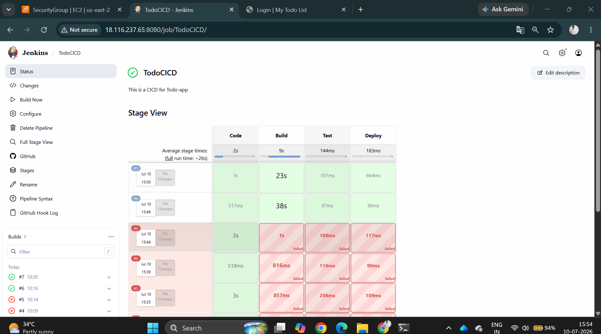
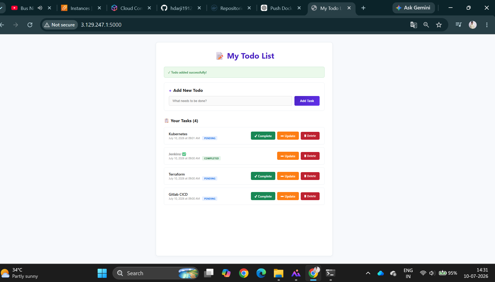

# 🚀 Todo Master – Flask To-Do Application with Docker & Jenkins CI/CD


A  **To-Do Application** built with **Flask**, **MySQL**, **HTML**, **CSS**, and **JavaScript**, containerized using **Docker** and automated through a **Jenkins CI/CD Pipeline**.

This project demonstrates real-world DevOps practices including containerization, automated deployment, secure authentication, and database management.

> 🎯 **Goal:** Build a production-ready To-Do application while learning Docker, Jenkins, and DevOps best practices.

```
# 💡 DevOps Concepts Covered

- Docker Images
- Docker Containers
- Docker Volumes
- Docker Networking
- Docker Compose
- Jenkins Pipelines
- Environment Variables
- GitHub Integration
- Docker Hub
- CI/CD Automation


```
---

# 📖 Application Overview

The application allows users to securely manage their daily tasks.

Each registered user has their own private workspace where they can:

- ✅ Register & Login
- ➕ Add Tasks
- ✏️ Edit Tasks
- ✔️ Mark Tasks as Completed
- 🗑️ Delete Tasks
- 🔒 Securely Store Passwords
- 📊 View Personal Dashboard

---

# 🗂️ Project Structure

```

todo-app/
│
├── templates/
| |-- images
│ ├── index.html
│ ├── login.html
│ |── register.html
│ 
│ 
├── app.py
├── requirements.txt
├── Dockerfile
|--docker-multi-stage
|--docker_build.sh
├── docker-compose.yml
├── Jenkinsfile
├── .env.example
├── README.md
└── schema.sql

```

---

# ✨ Features

- 🔐 Secure User Authentication
- 🔑 Login & Registration
- 📝 Create New Tasks
- ✏️ Update Existing Tasks
- ✅ Complete Tasks
- 🗑️ Delete Tasks
- 📱 Fully Responsive UI
- 💾 Persistent MySQL Storage
- 🐳 Docker Containerization
- 🔄 Jenkins CI/CD Pipeline
- ⚡ Flask Backend
- 🔒 Password Hashing


---

# ⚙️ Tech Stack

| Layer | Technology |
|---------|------------|
| Frontend | HTML5, CSS3, JavaScript |
| Backend | Python, Flask |
| Database | MySQL |
| Authentication | Flask Session |
| Containerization | Docker |  Docker Compose |
| CI/CD | Jenkins |
| Version Control | Git & GitHub |


# 🚀 Getting Started

## Clone Repository

```bash
git clone https://github.com/hdarji1912/todo-app

cd todo-app
```

# 🐳 Docker Deployment

Build Image

```bash
docker build -t todo-app .
```

Run Container

```bash
docker run -p 5000:5000 todo-app
```

Using Docker Compose

```bash
docker-compose up --build
```

---

# 🔄 Jenkins CI/CD Pipeline

The project includes a complete Jenkins pipeline.

### Pipeline Stages

```
GitHub Push
      │
      ▼
Jenkins Trigger
      │
      ▼
Checkout Source Code
      │
      ▼
Install Dependencies
      │
      ▼
Run Tests
      │
      ▼
Build Docker Image
      │
      ▼
Push Image to Docker Hub
      │
      ▼
Deploy Application
```

----
# 📸 Screenshots

## Login Page



## Jenkins Pipeline



## Dashboard



```
---

# 👨‍💻 Author

**Hardik Darji**

LinkedIn: https://www.linkedin.com/in/hardikdarji01

---

# ⭐ Support

If you found this project helpful, don't forget to **⭐ Star** the repository.

---
